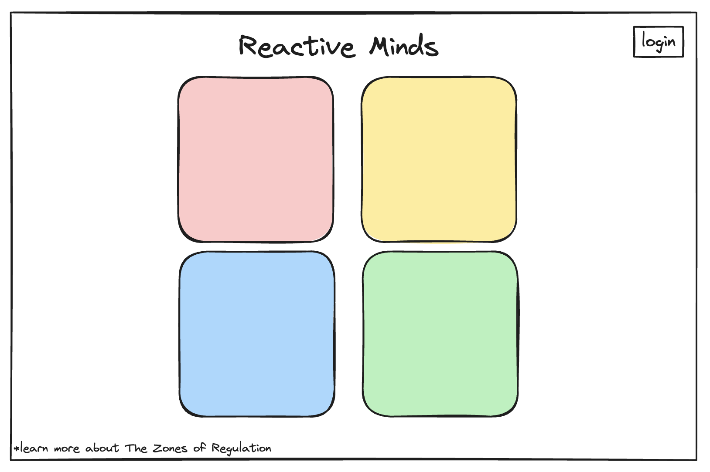
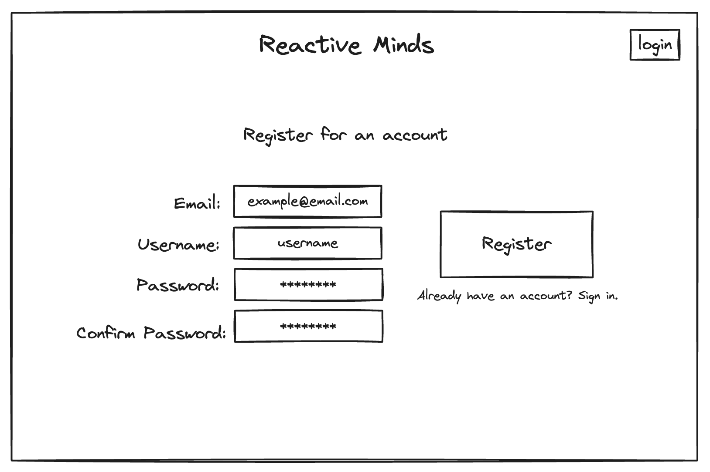
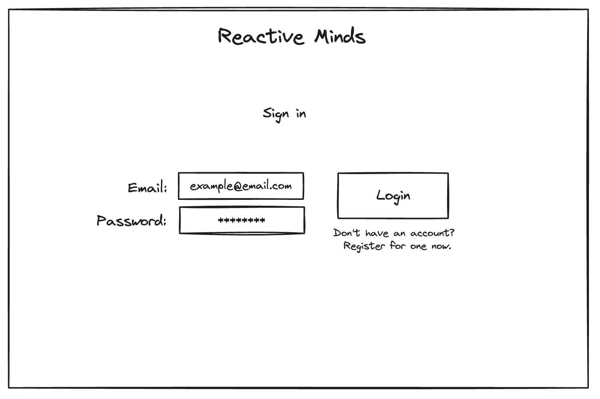
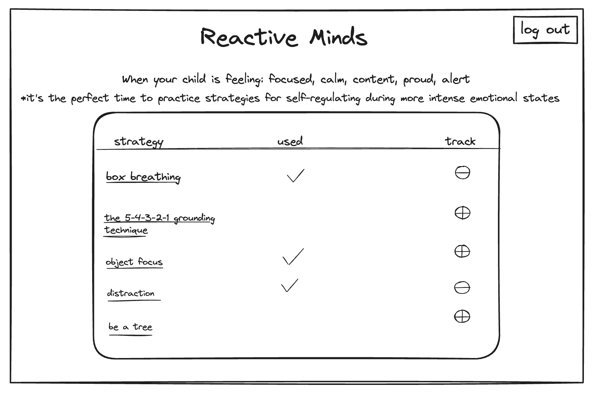
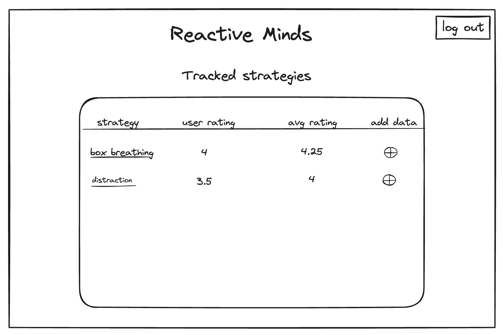
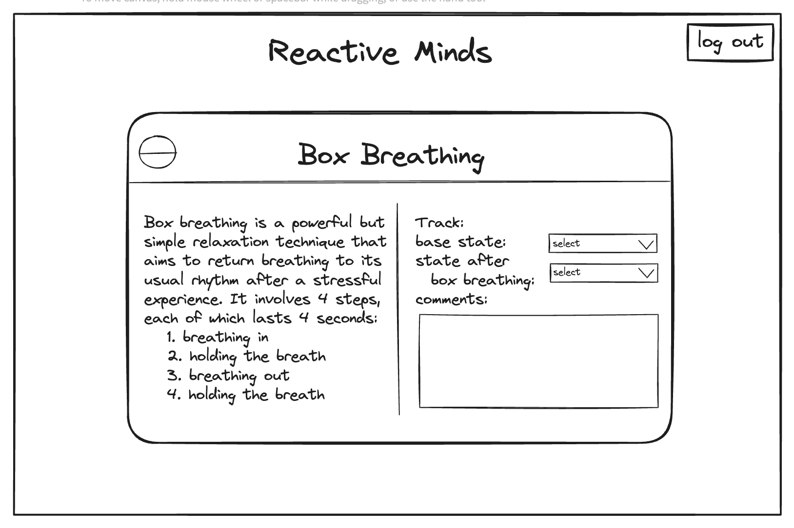

# Project Title

Reactive Minds

## Overview

Reactive Minds is a platform where parents can learn about emotion dysregulation, find strategies for learning and practicing more effective self-regulation, as well as track what does and doesn't work so they can gain insights that will help their reactive child thrive throughout their development.

### Problem

Emotion dysregulation is a normal part of early childhood development, but for many individuals it persists into later stages of life. It's common in (but is not limited to) neurodivergent individuals and those with mental health disorders. Emotion dysregulation can have profound negative impacts on those individuals who experience it as well as their family, friends, and peers at school or work.

### User Profile

- Primary caregivers:
  - that want to better understand the experiences of their emotionally dysregulated child
  - that want to help their child learn to self-regulate more effectively
  - that want to track strategies they've previously employed and the efficacy of those strategies
  - that want to communicate with other key people in the child's life to ensure consistency in managing intense emotional states
  - who may also struggle with emotion dysregulation
- Teachers, therapists, & other key figures in the child's life:
  - that want to stay up-to-date with what strategies have been used effectively at home
  - that want to track strategies they've tried outside of the home, and the efficacy of those strategies
  - that want to communicate with primary caregivers to ensure consistency in managing intense emotional states

### Features

- As a user, I want to be able to learn about emotion dysregulation
- As a user, I want to be able to learn to recognize the zones of regulation
- As a user, I want to be able to find relevant strategies to employ for each of the zones of regulation

- As a user, I want to be able to create a caregiver or support person account to manage data about a given child
- As a user, I want to be able to log in to my account to manage data about a given child

- As a logged in user, I want to be able to save a collection of "favourite" strategies to track
- As a logged in user, I want to be able to track a given child's base emotional state using the concept of zones of regulation
- As a logged in user, I want to be able to track strategies used to encourage self-regulation for a given child
- As a logged in user, I want to be able to track a given child's emotional state using the concept of zones of regulation AFTER employing different strategies
- As a logged in user, I want to be able to view past tracking data for a given child

## Implementation

### Tech Stack

- React
- MySQL
- Express
- Client libraries:
  - react
  - react-router
  - axios
- Server libraries:
  - knex
  - axios
  - uuid
  - express
  - bcrypt for password hashing

### APIs

- No external APIs will be used. An API will be created for this project.

### Sitemap

- Home page
- Register
- Login
- List (global) strategies for self-regulation
- View details for a specific strategy
- View + update user's tracked strategies

### Mockups

#### Home Page



#### Register Page



#### Login Page



#### List Strategies Page



#### List User's Tracked Strategies Page



#### View Strategy Details Page



### Data


### Endpoints

**GET / strategies/:emotionalState**

- Get strategies for self-regulation, with optional "used" indicator and "add/remove" button if the user is logged in and has previously tracked use of the strategy

Parameters:

- emotional state: user provided as a number (1-4)
- token (optional): JWT used to add "tracked" boolean

Response:

```
[
    {
        "id": '9b1deb4d-3b7d-4bad-9bdd-2b0d7b3dcb6d',
        "name": "box breathing",
        "emotional_state": [
            "high",
            "medium"
        ],
        "used": true,
        "saved": true
    },
    ...
]
```

**GET / users/:user_id/strategies**

- Get the user's saved strategies

Parameters:

- user_id: user id as string

Response:

```
[
    {
        "id": '9b1deb4d-3b7d-4bad-9bdd-2b0d7b3dcb6d',
        "name": "box breathing",
        "saved": true,
        "user_avg_rating": 4,
        "avg_rating": 4.25
    }
]
```

**GET / users/:user_id/strategies/:id**

- Get one of the user's saved strategies by id

Parameters:

- user_id: user id as string
- id: strategy id as string

Response:

```
[
    {
        "id": '9b1deb4d-3b7d-4bad-9bdd-2b0d7b3dcb6d',
        "name": "box breathing",
        "description": "Box breathing is a powerful but simple relaxation technique that aims to return breathing to its usual rhythm after a stressful experience. It involves 4 steps, each of which lasts 4 seconds: 1. breathing in, 2. holding the breath, 3. breathing out, 4. holding the breath",
        "saved": true
    }
]
```

**POST / users/:user_id/strategies/:id**

- Logged in user can track use of the strategy, including rating the efficacy for the current instance

Parameters:

- id: strategy id as string
- token: JWT of the logged in user

Response:

```
[
    {
        "id": '9b1deb4d-3b7d-4bad-9bdd-2b0d7b3dcb6d',
        "name": "box breathing",
        "emotionalState": [
            "high",
            "medium"
        ],
        "baseEmotionalState": "",
        "regulatedEmotionalState": "",
        "currentRating": 5,
        "comments": []
    }
]
```

**POST / users/register**

- Add a user account

Parameters:

- email: User's email
- password: User created password
- username: User provided

Response:

```
{
    "token": "seyJhbGciOiJIUzI1NiIsInR5cCI6IkpXVCJ9.eyJzdWIiOiIxMjM0NTY3ODkwIiwibmFtZSI6I..."
}
```

**POST / users/login**

- Log into a user account

Parameters:

- email: User's email
- password: User provided password

Response:

```
{
    "token": "seyJhbGciOiJIUzI1NiIsInR5cCI6IkpXVCJ9.eyJzdWIiOiIxMjM0NTY3ODkwIiwibmFtZSI6I..."
}
```

### Auth

- JWT auth
  - Before adding auth, all API requests will be using a fake user with id 1
  - Added after core features have first been implemented
  - Store JWT in localStorage, remove when a user logs out
  - Add states for logged in showing different UI in places listed in mockups

## Roadmap

- Create client

  - react project with routes and boilerplate pages

- Create server

  - express project with routing, with placeholder 200 responses

- Create migrations

- Gather 15 sample strategies for emotion self-regulation

- Create seeds with sample strategy data

- Feature: Home page

- Feature: List strategies for a given emotional state

  - Implement list strategies page
  - update state with given emotional state
  - Create GET / strategies/:emotionalState endpoint

- Feature: Register new user

  - Implement register page & form
  - Create POST /users/register endpoint

- Feature: Login

  - Implement login page & form
  - Create POST /users/login endpoint

- Feature: List User Strategies

  - Implement list user strategies page
  - Store JWT token in sessionStorage
  - Create GET / users/:userId/strategies endpoint

- Feature: View strategy details

  - Implement strategy details page
  - Store JWT token in sessionStorage
  - Create GET / users/:userId/strategies/:id endpoint
  - Create POST / users/:userId/strategies/:id endpoint

- Feature: Implement JWT tokens

  - Server: Update expected requests / responses on protected endpoints
  - Client: Store JWT in local storage, include JWT on axios calls

- Fix bugs

- Demo day!

Scope your project as a sprint. Break down the tasks that will need to be completed and map out timeframes for implementation. Think about what you can reasonably complete before the due date. The more detail you provide, the easier it will be to build.

## Nice-to-haves

- Ability to add connection/relationship to other users
  - Shared views of strategy tracking for a given child
  - Ability to send & receive private messages
- Expand user's strategy tracking
  - Add new/custom strategies to track
  - Circumstances (eg: location, events or other factors precipitating intense emotional state)
  - Graphic / visualization of tracked data
    - Ability to see trends in use of & efficacy of strategies tracked (ie relationships with circumstances)
- Ability to set reminders (for checking in with / tracking emotional state)
- Forgot password functionality
